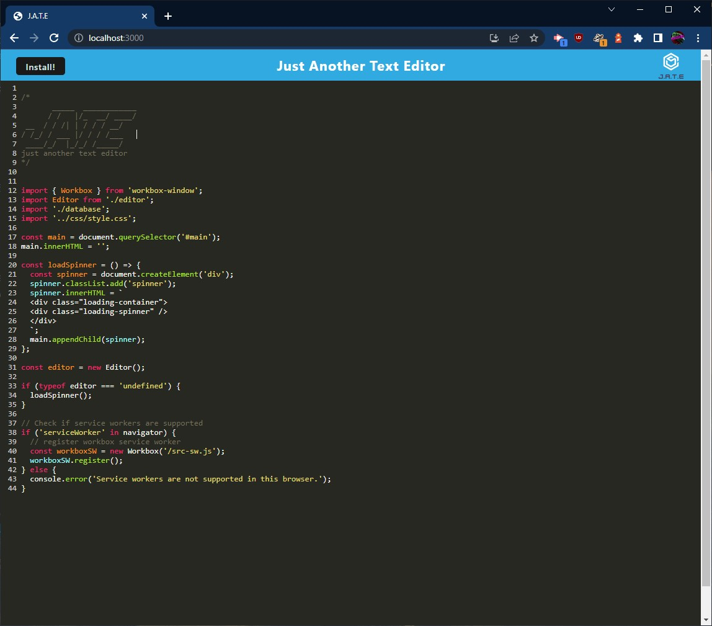

# PWA Text Editor

## Description

This project is a Progressive Web Application (PWA) Text Editor. It allows the user to create notes and code snippets with and without an internet connection. Designing an application like this takes advantage of lots of different concepts and new technologies. Such as using Get and Put routes for IndexedDB with the idb package. 
Using service workers and and webpack plugins. The application will also be downloadable and work offline and most importantly saves the content the user creates.

Going into this project I took some time getting the hang of how it all works especially with the bundled files making errors harder to figure out. But as I got more experience and researched more I am more confident. 

## Installation

If going to the hosted Heroku link the user can install the application using the install button or use the application in browser. 

If you would like to clone and install on a local machine you will need to have:

* Node.js v16
* GitBash or equivalent

You will also need to install the dependencies by running `npm install` in the root folder.
Then to run locally you will need to to use `npm run start`.
Visit the address of `http://localhost:3000/` to view your working application. 

## Usage

The Heroku link is: 
https://evening-lowlands-74305.herokuapp.com/

Create notes or code snippets with this editor and they will be saved and usable even if the application goes offline. The information is saved when application loses focus.
It also has an install button to so it can be installed as a PWA by the user for usage without the browser.

App Screenshot:

## Credits

Mark Napolitano

## License

ISC License

---